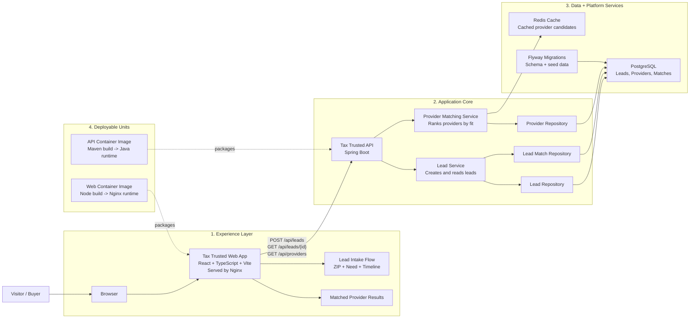
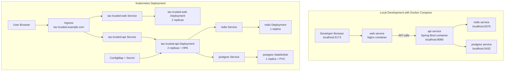

# Tax Trusted

A full-stack reference implementation for a RamseyTrusted-style tax provider marketplace.

The product flow is simple:

1. A visitor enters their ZIP code.
2. They select what kind of tax help they need.
3. The backend creates a lead.
4. The matching service scores providers by specialty, service area, rating, capacity, and response speed.
5. The frontend shows recommended tax pros and the lead status.

## Stack

- Frontend: React, TypeScript, Vite
- Backend: Java 21, Spring Boot, Spring Web, Spring Data JPA
- Database: PostgreSQL with Flyway migrations and query indexes
- Cache: Redis for provider search/matching lookups
- Ops: Docker Compose, Kubernetes manifests, HPA, readiness/liveness probes

## Architecture



At a high level, the browser talks to the web app, the web app calls the Spring Boot API, and the API persists leads and matches in PostgreSQL while using Redis to cache reusable provider candidate lookups. Flyway applies schema and seed data as the backend starts.

The matching flow is synchronous in this reference app: a lead is saved first, candidate providers are fetched and scored, the top matches are stored, and the response is returned to the frontend for display.

## Deployment Topology



The repo supports two deployment modes:

- `docker compose` for local development, where every service runs on your machine and the web app is exposed at `http://localhost:5173`.
- Kubernetes for hosted environments, where traffic enters through the NGINX Ingress on `tax-trusted.example.com`, routes to separate web and API Services, and the API scales horizontally with an HPA while Postgres keeps persistent storage through a StatefulSet volume claim.

## Run Locally

```bash
cd tax-trusted
docker compose up --build
```

Then open:

- Web: http://localhost:5173
- API: http://localhost:8080
- Health: http://localhost:8080/actuator/health

## API

```http
POST /api/leads
GET /api/leads/{id}
GET /api/providers?zipCode=37067&need=PERSONAL_TAXES
```

Example lead:

```json
{
  "zipCode": "37067",
  "needs": ["PERSONAL_TAXES", "SMALL_BUSINESS_TAXES"],
  "timeline": "THIS_MONTH",
  "firstName": "Juan",
  "lastName": "Cabral",
  "email": "juan@example.com",
  "phone": "555-555-5555"
}
```

## Scaling Notes

- Provider queries are indexed by active status and ZIP code.
- Lead rows are indexed by status and creation date for operations dashboards.
- Redis caches repeated ZIP/specialty provider searches.
- Matching is isolated in `ProviderMatchingService` so scoring can evolve independently.
- API pods include readiness/liveness probes and horizontal autoscaling.
- Frontend and backend are separate deployables, so traffic can scale independently.
# tax-trusted
