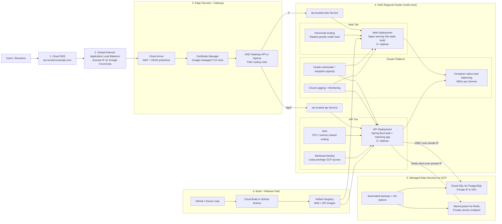

# Tax Trusted

A full-stack reference implementation for a RamseyTrusted-style tax provider marketplace.

The product flow is simple:

1. A visitor enters their ZIP code.
2. They select what kind of tax help they need.
3. The backend creates a lead.
4. The matching service scores providers by specialty, service area, rating, capacity, and response speed.
5. The frontend shows recommended tax pros and the lead status.

## Stack

- Frontend: React, TypeScript, Vite
- Backend: Java 21, Spring Boot, Spring Web, Spring Data JPA
- Database: PostgreSQL with Flyway migrations and query indexes
- Cache: Redis for provider search/matching lookups
- Ops: Docker Compose, Kubernetes manifests, HPA, readiness/liveness probes

## Architecture

The diagram below is the recommended **GCP production deployment** for this repo. It is slightly more detailed than the current manifests: the repo already has Kubernetes objects for `web`, `api`, `redis`, `postgres`, and `ingress`, and this diagram shows how those map to Google Cloud managed services and edge networking in a production setup.



### How Traffic Flows

1. Users resolve `tax-trusted.example.com` in Cloud DNS.
2. Traffic lands on a **global external Application Load Balancer**, which uses Google’s edge to terminate HTTPS close to the user.
3. **Cloud Armor** applies WAF and DDoS controls before traffic reaches the cluster.
4. The load balancer forwards traffic into **GKE Gateway / Ingress** rules.
5. Routing is path-based:
   - `/` goes to the `tax-trusted-web` Service.
   - `/api/*` goes to the `tax-trusted-api` Service.
6. GKE uses **container-native load balancing** with NEGs so the load balancer targets Pods directly rather than only nodes.
7. Inside the cluster, the `web` pods serve the static frontend and the `api` pods process lead creation, provider matching, and reads.
8. The API connects privately to **Cloud SQL for PostgreSQL** and **Memorystore for Redis** over the VPC.

### How The Gateway Works On GCP

- Best-fit option: **GKE Gateway API** with `gke-l7-global-external-managed`.
- Why: Google recommends the managed global external Gateway classes when you want the newer external Application Load Balancer features.
- Front door behavior:
  - One global Anycast IP.
  - TLS terminated at the Google edge.
  - Host and path rules map requests to Kubernetes Services.
- App mapping for this repo:
  - `tax-trusted.example.com/` -> `tax-trusted-web`
  - `tax-trusted.example.com/api/*` -> `tax-trusted-api`

### How Load Balancing Works

- **Layer 1: Global edge balancing**
  - Google Front Ends accept traffic on the global Anycast IP.
  - Requests are sent over Google’s backbone to healthy backends.
- **Layer 2: Service-to-pod balancing**
  - GKE exposes Services through NEGs so the load balancer can send traffic to individual Pods.
  - Health checks determine which backends are eligible.
- **Layer 3: Kubernetes scaling**
  - HPA scales pod replicas up and down.
  - Cluster autoscaler, or Autopilot capacity management, adds compute when pods can’t be scheduled.

### GCP Deployment Detail

- **Compute**
  - GKE regional cluster across multiple zones for higher availability.
  - Separate Deployments for `web` and `api`.
  - `api` should keep readiness and liveness probes, which the repo already defines.
- **Networking**
  - Cloud DNS for the public hostname.
  - Global external Application Load Balancer at the edge.
  - Gateway API or GKE Ingress for HTTP routing into the cluster.
  - Private VPC connectivity to data services.
- **Data**
  - Cloud SQL for PostgreSQL is the production replacement for the in-cluster Postgres StatefulSet.
  - Memorystore for Redis is the production replacement for the in-cluster Redis Deployment.
  - Private IP is preferred for both.
- **Security**
  - Cloud Armor for edge protection.
  - Certificate Manager for managed TLS.
  - Workload Identity for GKE so pods use IAM without long-lived service account keys.
  - Secrets should move from plain Kubernetes secrets to Secret Manager integration if you want a stronger production posture.
- **Operations**
  - Cloud Logging and Cloud Monitoring for telemetry.
  - HPA for pods and cluster autoscaler for node capacity.
  - Artifact Registry for container images.
  - Cloud Build or GitHub Actions for build and deploy automation.

### Mapping From This Repo To GCP

- [`k8s/web.yaml`](/Users/juancabral/Documents/New%20project%202/tax-trusted/k8s/web.yaml): maps to the GKE `web` Deployment and Service.
- [`k8s/api.yaml`](/Users/juancabral/Documents/New%20project%202/tax-trusted/k8s/api.yaml): maps to the GKE `api` Deployment, Service, probes, and HPA.
- [`k8s/ingress.yaml`](/Users/juancabral/Documents/New%20project%202/tax-trusted/k8s/ingress.yaml): maps to the external HTTP entry point; on GCP I would evolve this toward Gateway API.
- [`k8s/postgres.yaml`](/Users/juancabral/Documents/New%20project%202/tax-trusted/k8s/postgres.yaml): fine for demos, but in GCP production I’d replace it with Cloud SQL.
- [`k8s/redis.yaml`](/Users/juancabral/Documents/New%20project%202/tax-trusted/k8s/redis.yaml): fine for demos, but in GCP production I’d replace it with Memorystore.

### Local vs Hosted

- `docker compose` is still the fastest local setup: `web`, `api`, `postgres`, and `redis` run on your machine.
- The **hosted GCP version** uses the same app split, but moves ingress, load balancing, TLS, autoscaling, and managed data onto Google Cloud services.

## Run Locally

```bash
cd tax-trusted
docker compose up --build
```

Then open:

- Web: http://localhost:5173
- API: http://localhost:8080
- Health: http://localhost:8080/actuator/health

## API

```http
POST /api/leads
GET /api/leads/{id}
GET /api/providers?zipCode=37067&need=PERSONAL_TAXES
```

Example lead:

```json
{
  "zipCode": "37067",
  "needs": ["PERSONAL_TAXES", "SMALL_BUSINESS_TAXES"],
  "timeline": "THIS_MONTH",
  "firstName": "Juan",
  "lastName": "Cabral",
  "email": "juan@example.com",
  "phone": "555-555-5555"
}
```

## Scaling Notes

- Provider queries are indexed by active status and ZIP code.
- Lead rows are indexed by status and creation date for operations dashboards.
- Redis caches repeated ZIP/specialty provider searches.
- Matching is isolated in `ProviderMatchingService` so scoring can evolve independently.
- API pods include readiness/liveness probes and horizontal autoscaling.
- Frontend and backend are separate deployables, so traffic can scale independently.
